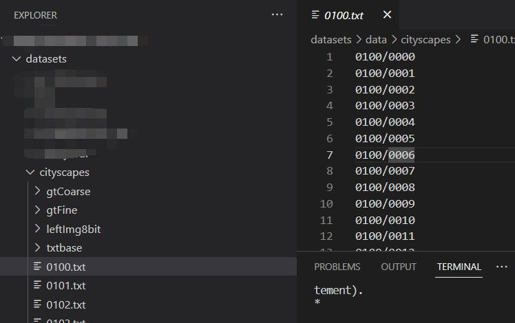
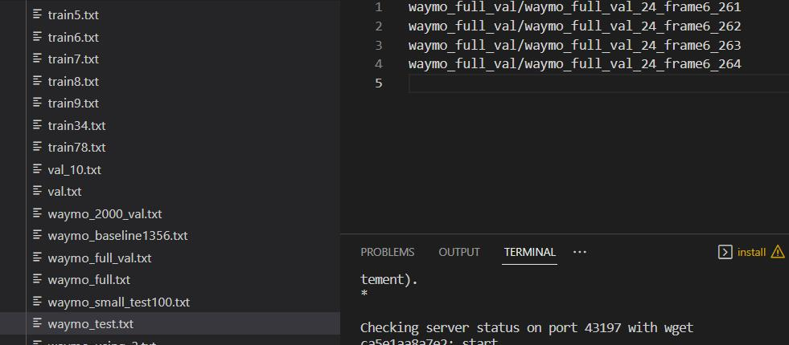

## Description
Most of this repo are copied from ```https://github.com/NVlabs/SegFormer.git``` 
are used for Segformer train and evaluation.
## Small modification
In order to utilize different dataset, simply transform different kind images into [mmseg_cityscapes_format](https://github.com/open-mmlab/mmsegmentation.git). 
```
You should change: ./local_configs/_base_/datasets/cityscapes_1024x1024_repeat.py #3 
My data path
/HDD_DISK/datasets/data/cityscapes/
```

Please refer to ```https://github.com/open-mmlab/mmsegmentation.git```( using txt file to select)

I provide a simple example to transform different dataset.In this repo: 

```
python mmseg_write_imgs.py
```
and label definition in ./label_test/cityscapes.json

Please change ./tool/test.py or ./tool/train.py. I modify their args to select 'scenes', because I want to do traing or test on different section of whole dataset.

If you use mmseg lastest repo or this repo, you should check
```
./mmseg/datasets/pipelines/loading.py #60
```
Be sure that you are loading the img file you need

### Installation
Most of my env are from [Segformer](https://github.com/NVlabs/SegFormer.git).
And you may check the ```./requirements.txt```, if you have some env error. My system is linux 20.04 with cuda version 11.8.

### test example
Example:  test.sh config ckpt gpu_nodes --scene will(select your scene doing test)


```
./tools/dist_test.sh local_configs/segformer/B5/segformer.b5.1024x1024.city.160k.py ./work_dirs/first_sidewalk_curb/iter_156000.pth 1  --scene waymo_test
```



output: ./output_temp/ and You can modify here './mmseg/datasets/cityscapes.py #243' for your own output

Pretrained model I only used is mit-b5

Trained on four dataset (mapillary bdd idd cityscapes)
[model](https://drive.google.com/file/d/1upd5UJmH7ywloEyJZifY_Frs4IxkRojb/view?usp=drive_link)/
[log](https://drive.google.com/file/d/1Z8uFO_bprKqVndSfUpKu8qdPADYDp9ID/view?usp=drive_link)